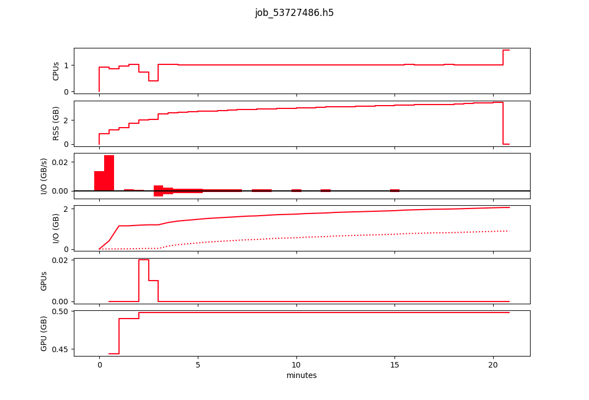
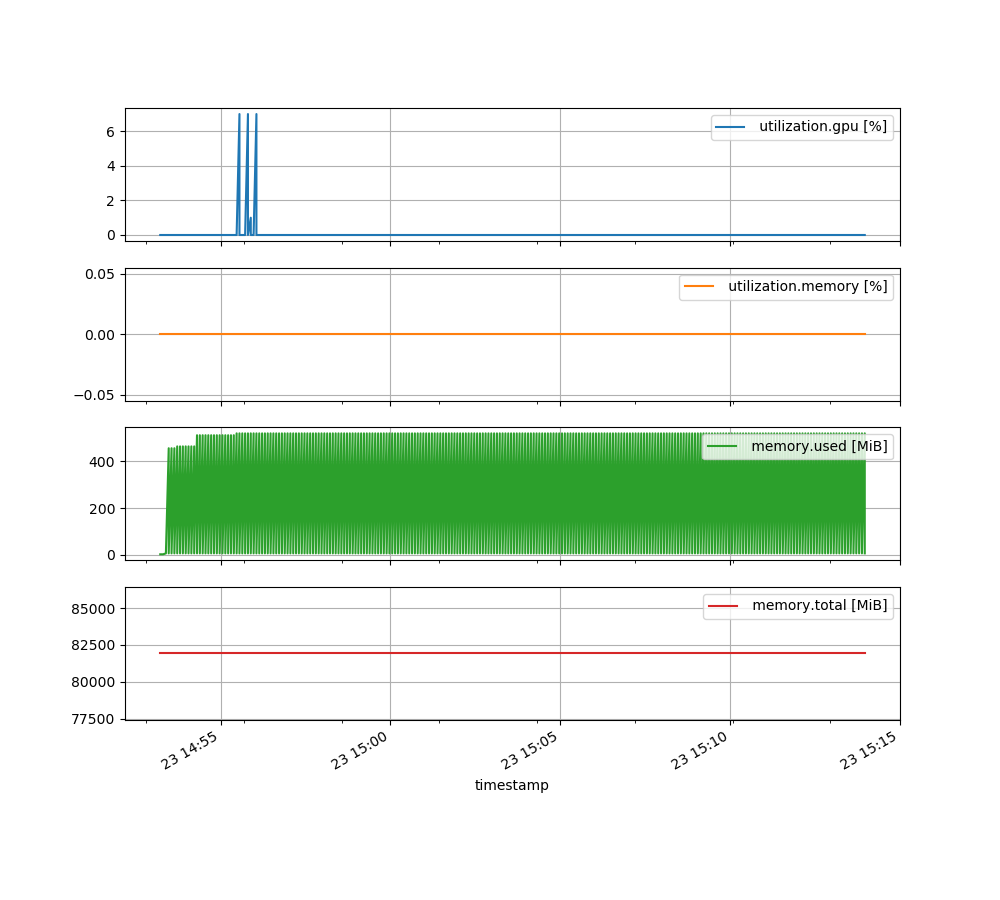

<h1 align="center">
   How to run Oceananigans.jl on Mahuika ( CPU/GPU)
</h1>


* Templates and CPU/GPU profile data for Oceananigans.jl (https://github.com/CliMA/Oceananigans.jl)  Julia package on NeSI Mahuika cluster

## baroclinic_adjustment.jl

* Expected output

https://github.com/user-attachments/assets/e699d95b-30e5-45b6-8b16-0dd808e63af9


### GPU and CPU profiling for baroclinic_adjustment.jl

* Following GPU and CPU profiling graphs are for slurm/baroclinic_adjustment.slurm

#### CPU/Memory/IO profile

```bash
═════════════════════════════════════════════════════════════
  NeSI SLURM JOB EFFICIENCY REPORT
═════════════════════════════════════════════════════════════

JOB INFORMATION
─────────────────────────────────────────────────────────────
Cluster: mahuika
Job ID: 53727486
State: COMPLETED
Cores: 6
Tasks: 1
Nodes: 1


EFFICIENCY METRICS
─────────────────────────────────────────────────────────────
Job Wall-time:
████░░░░░░░░░░░░░░░░░░░░░░░░░░ 13.4%
Used: 00:20:50 of 02:35:00 time limit

CPU Efficiency:
████░░░░░░░░░░░░░░░░░░░░░░░░░░ 16.5%
Used: 00:20:35 of 02:05:00 core-walltime

Mem Efficiency:
█████████████████░░░░░░░░░░░░░ 57.8%
Used: 3.47 GB of 6.00 GB

OPTIMIZATION TIPS
─────────────────────────────────────────────────────────────
• CPU efficiency is very low. Consider requesting fewer cores for similar jobs
• Job completed much faster than the time limit. Consider setting a shorter time limit

═════════════════════════════════════════════════════════════
```

<p align="center">

</p>

#### GPU profile with `nvidia-smi`

<p align="center">

</p>